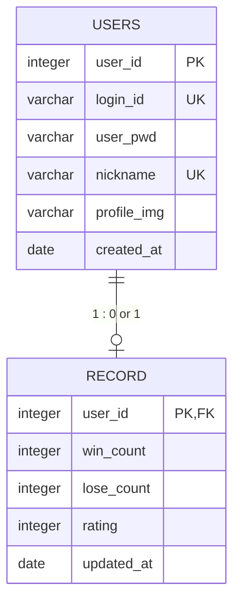

개발 기간 : 2025.12.12 ~ 2025.12.24 (13일)
플랫폼 : Web
개발 인원 : 6명

----

#  개발환경

- IDE: intellij, eclipse
- 서버: tomcat9 + JDK17
- DB: postgreSQL
- 기술 스택: JAVA, JSP, Servlet, CSS, JS

# 데이터베이스 설계 (ERD)

[웹 소켓을 이용한 오목_흐름도](https://app.diagrams.net/#G1A-UerBnSQWB8CKETi9cZNwWrvPYuyRjW#%7B%22pageId%22%3A%22QG-ehpcgJ_yH52B8JcRU%22%7D)

* MVC 모델

| 아키텍쳐 설계1 | 아키텍쳐 설계2 |
|:--:|:--:|
|||
